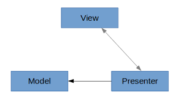
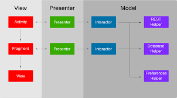
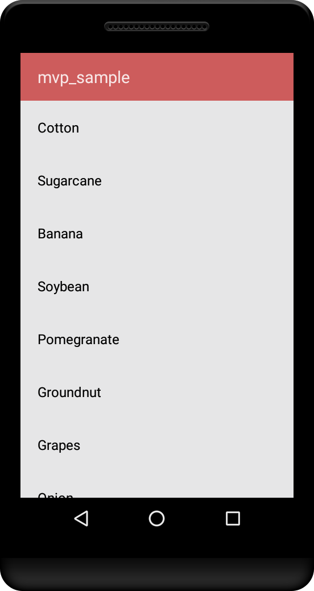

# MVP
Android Architecture [MVP](https://en.wikipedia.org/wiki/Model–view–presenter)(Model View Presenter) pattern

* __View (UI layer)__: A view component in MVP contains a visual part of the application.It contains only the UI and it does not contain any logic or knowledge of the data displayed. In typical implementations the view components in MVP exports an interface that is used by the Presenter. The presenter uses these interface methods to manipulate the view. Example method names would be: showProgressBar, updateData.

* __Presenter__: The presenter triggers the business logic and tells the view when to update. It therefore interacts with the model and fetches and transforms data from the model to update the view. The presenter should not have, if possible, a dependency to the Android SDK.

* __Model (Data Layer)__: Contains a data provider and the code to fetch and update the data. This part of MVP updates the database or communicate with a webserver.

# Architecture

# Benefits
MVP makes it easier to test your presenter logic and to replace dependencies. But using MVP also comes with a costs, it makes your application code longer. Also as the standard Android templates at the moment do not use this approach, not every Android developer will find this code structure easy to understand.

# Comparison to [MVC](https://en.wikipedia.org/wiki/Model–view–controller)(Model View Controller) pattern
In the Model View Presenter pattern, the views more separated from the model. The presenter communicates between model and view. This makes it easier to create unit tests Generally there is a one to one mapping between view and Presenter, but it is also possible to use multiple presenters for complex views.

In the Model View Controller pattern the controllers are behavior based and can share multiple views. View can communicate directly with the model.

MVP is currently on of the patterns that the Android community prefers.

# Demo

# Prerequisites
* __Android Studio 3.0__
* __Android Device with USB Debugging Enabled__

# Built With

* __[Android Studio](https://developer.android.com/studio/index.html)__ - The Official IDE for Android
* __[Java](https://en.wikipedia.org/wiki/Java_(programming_language))__ - The Official Language for Android
* __[Gradle](https://gradle.org)__ - Build tool for Android Studio

Thanks for reading this repo. Be sure to click ★ below to recommend this repo if you found it helpful. It means a lot to me.

For more about programming, follow me on [Medium](https://medium.com/@yash786agg)

Also, Let’s become friends on [Linkedin](http://bit.ly/24t4EVI)
